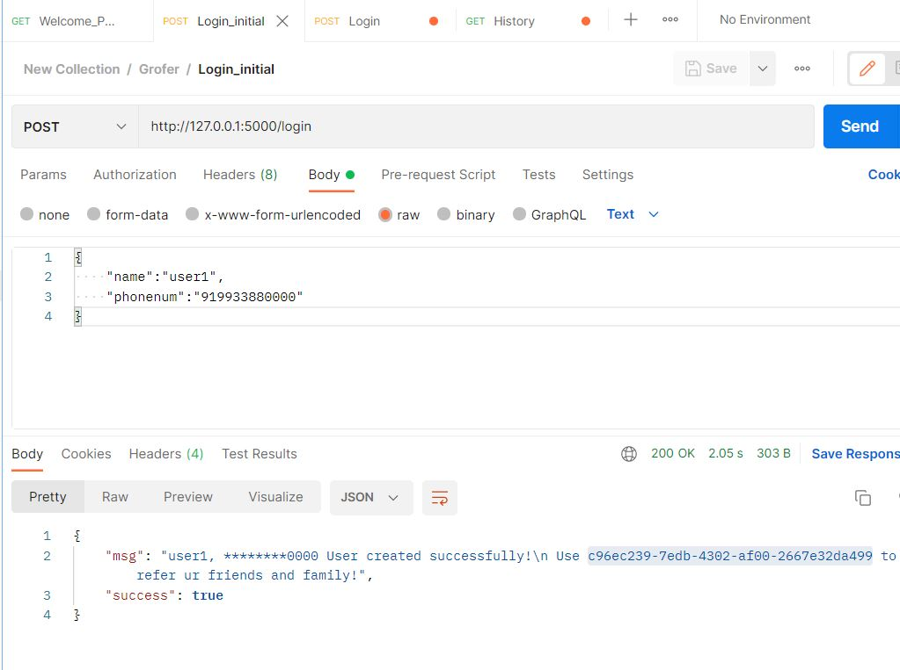

Refferal Systems working API 

#Requirements:
We have used Python programming language and Flask framework for implementing API's amd MySQL for the databases in Windows 10 system.
We used MySQL connector for connecting with mySQL databases.
I have used Postman to test the API's.

# Explaination regarding Table (ReferralSystem):
Col1-> Phone Number   (primary key) 
Col2-> Full Name      
Col3-> Referral code  (personal referral ID)
Col4-> Referred Number (Number of users who used his refferal code)=> which defines his milestone.
Col5-> Referred Contacts (Contact numbers of users who have used our referrel code to SignUp)
Col6-> Balance (Individual's balance over incintives)=> increases when milestones are completed.

# Explaination regarding Referral_app.py:
It contains the following API's:
1. '/'                 [GET] Says Welcome to referral system upon opening the registration portal.

2. '/login'            [POST] Creates entries of the user's Name, Phone number,  Personal Referrel code (optional field).
                       If he isn't a new user (primary key phonenumber)=>Displays an "Invalid Username message".
             
3. '/get-user-details  [GET] Primarily takes Phonenumber and shows the history of the user.
                       History consists of his phone number, Name, Personal Referral code, 
                       and Number people who used his referral, Milestone, Balance from Incintives,
                       And also Masked Phone numbers of referred users.
                       
4. '/withdraw-request  [POST] Deletes the Entry from the Table based on phonenum

# Explaination regarding queries.py:
1. We have used UUID package to generate referral ID (it generates 32 bit unique ID's)

2. CreateNewUser: (SignUp) updates the new user details in the table, it takes user phonenum and name as inputs and referral code is updated with generated uuid.
   Does not allow multiple Sign Ups.(as phn number has to unique)

3. GetValue Function: It helps to retrieve the user with a particular phone number or referal code. it takes field name i.e. value_name and the value as arguments 
   using which we retrieve the value.

4. UpdateReference: It is used the update referred user. it updates the referrednum and the referredcontacts and also the balance of the referred user.

5. Withdraw: Deletes the row entry from table with specific phonenumber value.

# localhost server running.

# Welcome Page

# User1 Login (Referral ID generated)

# User2 Login using user1 referral

# User3 Login using user1 referral

# User1 History (1 milestone left)

# User4 Loging using user1 referral

# User1 History (update in incintive & change of milestone)

# Wrong referral ID (does not exist in database)

# Wrong Phone number (our primary key needs to unique)

# Database

                      

